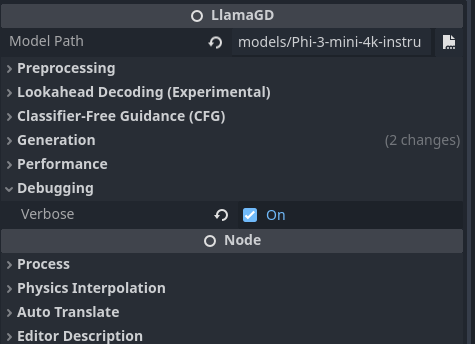

<p align="center">
   
   <p align="center">Fast Local Large Language Model Inference for Godot</p>
</p>

# Introduction

This project was originally created to offer fast large-language-model inference for a [Godot-based research project](https://github.com/plasteek/IronDrop). Although there are some feature-rich language model inference with extensions, they do not implement optimization techniques such as KV Caching, Flash Attention, and faster inference techniques, like **Lookahead Decoding**.

# Setup

1. Download the latest release of `llama.gd`
2. Extract the content to `addons/llama.gd` folder in your Godot project
3. Download model with `.gguf` format

# Compiling from Source

1. Make sure you have all the pre-requisite required to compile `llama.cpp` from, and `cmake`
2. Install `ninja` using tools like `scoop` or `chocolatey`

```shell
scoop install ninja # or
choco install ninja # please look at the install for choco specifically
```

3. Run the build ps1 file (or copy the cmake command from the respective file)

```shell
# Build for CPU only, no other dependency required but won't use GPU
./build-cpu.ps1
# Build with CUDA (Will crash on Godot but compile successfully), ensure you have the CUDA API installed
./build-cuda.ps1
# Build for Vulkan(GPU), ensure you have Vulkan installed
./build-vulkan.ps1
```

# Using the Extension

<p align="center">
   
   <br/>
   <b>llama.gd</b> Panel Preview
</p>

## Loading a model

Make sure to the model path is valid before loading the model.

```gdscript
@export var llama: LlamaGD;

func _ready():
   llama.load_model()
   await llama.model_loaded
```

Some other useful function

```gdscript
llama.is_loading_model()
llama.is_model_loaded()
```

## Running Inference

```gdscript
llama.create_completion("Prompt Here") # Will block your game, recommend to use a separate thread

# Automatically creates the thread (recommended)
llama.create_completion_async("Prompt Here")
var result = await llama.generation_completed
```

If you want more control or have a direct list of token, do the following:

```gdscript
var tokens = llama.tokenize("Some prompt here") # Returns a list of tokens
llama.predict_sequence(tokens) # Or
llama.predict_sequence_async(tokens)
```

To stop generation,

```gdscript
if llama.busy: # If there is a generation running
   llama.stop_generation()
```

## Listen to Each Predicted Token

If you want to have a `ChatGPT`-esque generation, you might want to append each token to the result and display the incomplete result

```gdscript
@export var llama: LlamaGD;

func _ready():
   # Make sure model is loaded
   llama.new_token_generated.connect(func(new_token): print("New Token: %s" % new_token))
```

## Special Characters

Language Models have special tokens what signifies where the generation starts and ends. You can get them as follows:

```gdscript
# Get the tokens as string
llama.get_model_bos()   # Beginning of Sentence
llama.get_model_eos()   # End of Sentence

# Get the tokens as their ids
llama.get_model_bos_id() # Beginning of Sentence
llama.get_model_eos_id() # End of Sentence
```

## KV-Caching

Language Models need to consume your next from left to right before beginning prediction, which means it would be significantly slower if you have longer text. KV-Caching is a technique that stores these 'left-to-right' computation so prediction could begin immediately without additional computation. This technique is great if you want some common initial text or prompt which does not change.

This library abstract caching in a class `LlamaState`, which stores all the variables (including the kv-cache).

### Creating State

```gdscript
var state = llama.create_state("Prompt to Cache") # It is recommended to run on a thread

llama.create_state_async("Prompt to Cache")
var state = await llama.state_created
```

### Using State

Please note that whatever prompt you specify in the state would be automatically be concatenated.

```gdscript
llama.create_state_async("Hello, my name is")
var state = await llama.state_created

llama.use_state(state)
llama.create_completion_async(' John!') # The prompt is automatically "Hello, my name is John!"
```

### Storing the State in a file

Normally, you would like to store the cache in a file before production.

```gdscript
LlamaStateFile.read_to_file("Path to file") # Returns llama state
LlamaStateFile.write_to_file(llama_state)
```

When reading state, if you state is too big, it is recommended to run it in a separate thread to prevent lag spike.

## Handling Failures

If you would like to handle the errors rather than crashing or becoming unresponsive

```gdscript
llama.generation_failed.connect(func (error_msg): print(error_msg)) # Includes state creation
llama.model_load_failed.connect(func (error_msg): print(error_msg))
```

## Low-Level API

### Tokenization and Decode

```gdscript
var tokens = llama.tokenize("Hello world!) # Returns array of number/id
var string = llama.decode(tokens) # Returns the string "Hello world!"

# NOTE: tokenize usually appends the model's bos by design, so when you decode it would most likely becoming "[model_bos_here]Hello world!"
```

# Roadmap

-  [ ] Return a signal for each async function in `cpp` to avoid weird syntax

# Special Thanks

We would like to thank [llama.cpp](https://github.com/ggerganov/llama.cpp) for the awesome inference library which we use for this extension and [godot-llm](https://github.com/Adriankhl/godot-llm) for the inspiration
